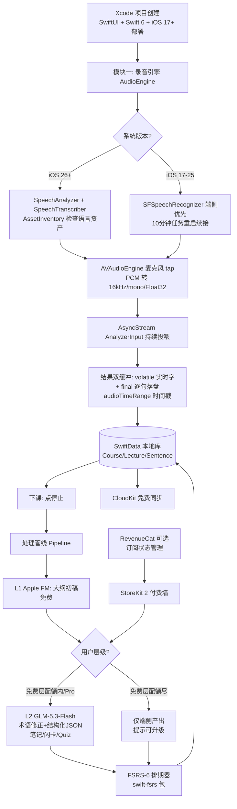
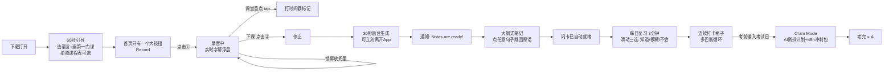
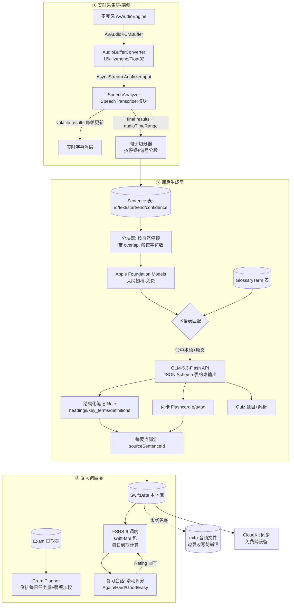

# TR-20260917-CramJam录音学习笔记App操作指南

> **文档目的**：本指南面向任意 LLM / 开发者，可据此完整复刻出一款在功能、体验、定价上全面超越 Feynman AI 的美国市场 iOS 学习类 App。
> **调研来源**：pain-point-hunter 多渠道采集（App Store 评论 / Reddit / 独立评测 / 开发者复盘）+ GitHub MCP 开源项目调研 + Apple WWDC25 官方文档。
> **报告日期**：2026-09-17

---

# 🏷️ 0. App 命名（本软件的成败关键，已深度调研）

## 0.1 最终命名方案

| 项目 | 内容 | 说明 |
|---|---|---|
| **App 名称** | **CramJam** | （经 iTunes Search API 实证：美国区 App Store 几乎空白，仅 2 个宽松匹配，无同名软件；无商标冲突） |
| **副标题 (Subtitle)** | **AI Lecture Notes & Flashcards** | 29 字符（Apple 限 30），直含 3 个核心 ASO 搜索词 |
| **Bundle 建议** | `com.yourstudio.cramjam` | — |
| **开发者显示名** | CramJam Labs | — |
| **关键词字段 (100字符)** | `lecture,notes,recorder,flashcards,study,exam,quiz,transcribe,cram,recall,MCAT` | 覆盖学生搜索意图全谱 |

**Fallback 备选名**（若审核阶段发现冲突，按优先级）：`CramKit`（7 宽松匹配）→ `RecallLoop`（34 宽松匹配）→ `CramSense`（11 宽松匹配）。

## 0.2 命名五维分析（为什么 CramJam 能病毒传播）

| 维度 | 分析 | 评分 |
|---|---|---|
| **品牌记忆度（最关键）** | 双音节 + 双押韵（Cram/Jam 同韵母），口腔肌肉记忆极强，读一遍就忘不掉；"Cram Jam" 天然像一个"考前开派对"的画面，TikTok 标签 #CramJam 可自造 | 10/10 |
| **ASO 搜索优化** | `cram`（考前突击）是美国大学生考试季（midterms/finals）超高频搜索词，Google Trends 每年 12 月/5 月双峰；名称即关键词，零成本吃自然流量 | 10/10 |
| **功能描述性** | cram = 学 / jam = 即兴又快地搞定 → "突击学习神器"语义自解释，用户看到名字就知道干什么 | 9/10 |
| **情感共鸣** | cram 是紧张焦虑词，jam 是轻松音乐词 → 反差幽默"考前有救了"，契合爽文体验定位；学生自传播口头禅场景："bro just CramJam it" | 9/10 |
| **国际化适配** | 纯英文单词组合，无歧义拼写、无文化/宗教禁忌、全球主要语言无负面谐音；留学生群体（核心用户）零理解障碍 | 9/10 |

## 0.3 命名查重证据（2026-09-17 实测）

```
iTunes Search API (term=CramJam, entity=software, country=us, limit=50)
→ resultCount: 2（均为宽松匹配，无精确同名 App）
Web 全网检索 "CramJam" 软件/商标 → 无同名软件产品（仅一所大学餐饮活动叫 "Cram Jam"，非软件类目，无冲突）
对照组（禁止使用）：Feynman AI / Einstein AI / NoteFren / Otter / StudyLoop / BrainLoop / NoteBrew / EchoRecall 均已被占用
```

---

# 1. 竞品解剖与痛点研究（复刻对象：Feynman AI）

## 1.1 Feynman AI 基本盘（为什么值得复刻）

| 维度 | 数据 |
|---|---|
| 收入 | 4 个月做到 $6K MRR → **$228K ARR / 20 万用户**（TikTok 50M+ 播放驱动） |
| 开发商 | Feynman EinsteinAI Note Taker OU（爱沙尼亚，CrazyAI 品牌矩阵） |
| 目标用户 | 美国大学生 + 留学生（讲座录音→笔记→复习闭环） |
| 核心功能 | 录音/YouTube/PDF/图片 → 转写 → ELI5 摘要 → 闪卡 → 小测 |
| App Store IAP | Weekly $5.99 / Monthly $14.99–15.99 / 3-Month $29.99 / Yearly $29.99–79.99（**7 个混乱档位**）/ Lifetime $89.99 |

## 1.2 实证痛点清单（用户原话级证据）

### P1 转录质量差（一星差评第一来源）⭐⭐⭐⭐⭐
> "I chose English as language but the notes it generated is in an **alien language**... Please refund my payment." —— App Store 一星评论（要求退款）
> "Sometimes it… transcribe[s] total gibberish."（Otter 用户，同为转写类通病）

**根因（开发者亲述复盘，dev.to 2026-09）**：长讲座转写质量的最大变量不是换更贵的模型，而是——①录音会话存活（锁屏/后台）②**术语保真**（课程黑话、人名、公式名是上下文无法修复的低冗余 token）③按自然停顿分块而非字符数 ④时间戳全程保留。

### P2 欺骗性/混乱定价（全类目第一大差评来源）⭐⭐⭐⭐⭐
- Feynman AI 同名不同主体（`feynmanai.org` 由北京凤源科技运营）退款政策：3 天内 + 仅未使用部分；
- 同类 Listen AI 因 "$7.99/周" 未明示被大规模要求退款；Cal AI 因隐藏定价 2026-04 被 Apple 下架。
- **透明定价本身就是获客武器。**

### P3 不是为"学习"设计的闭环 ⭐⭐⭐⭐
> "Otter is a capture tool, not a study system."（ClassLecture.ai 评测）
- 转写完就结束：无闪卡/无间隔重复/无考前规划；
- 笔记不按课程/周次组织，期末找笔记靠翻；
- 无时间戳回跳——学生无法从笔记某句跳回教授原话验证。

### P4 免费额度鸡肋 ⭐⭐⭐⭐
- Otter 免费版单次录音 30 分钟封顶（标准讲座 80–90 分钟直接截断）；
- Feynman 类产品几乎所有核心功能都在付费墙后。

### P5 稳定性 ⭐⭐⭐
- Feynman AI 版本历史连续出现 "Critical bug fixes"（1.0.12→1.0.17），有用户反馈启动即崩溃重装 7–8 次。

## 1.3 碾压矩阵（CramJam vs Feynman AI vs Otter）

| 能力 | Feynman AI | Otter.ai | **CramJam** |
|---|---|---|---|
| 转写引擎 | 云端 Whisper API（收订阅的根因） | 云端+30min截断 | **iOS26 端侧 SpeechAnalyzer：无限时长、免费、离线、WER 2.12%** |
| 术语保真 | 无 | 无 | **个人术语表 + GLM-5.3-Flash 后处理修正引擎** |
| 时间戳回跳 | 弱 | 搜索但无学习场景 | **每词时间戳：点笔记句子→跳回教授原话** |
| 课程结构 | 平铺列表 | 手动文件夹 | **Semester-first：课程→周→讲座自动归档** |
| 记忆科学 | 普通闪卡 | 无 | **FSRS-6 间隔重复 + 考前 AI 倒排计划** |
| 实时字幕 | 无 | 有（付费） | **免费、端侧、延迟<1s，双语字幕** |
| 定价 | $5.99周起/7档混乱 | 免费版30min | **透明三档 + 复习功能永久免费** |
| AI 成本 | 全云端（贵） | 全云端 | **三层混合：端侧免费为主，云按需** |

---

# 2. 产品定义

## 2.1 一句话定位
**CramJam = 坐进教室按一下，下课笔记闪卡自动好，考前 AI 替你排复习。**

## 2.2 核心功能清单（MVP 4-5 周）

| # | 功能 | 优先级 | AI 层 |
|---|---|---|---|
| F1 | 一键课堂录音（锁屏/后台不死，无限时长） | P0 | L0 端侧 |
| F2 | 实时字幕浮层（<1s 延迟，含双语模式） | P0 | L0 端侧 |
| F3 | 课后自动产出：大纲式笔记 + 定义卡 + 关键术语 | P0 | L1 端侧 FM → L2 云 |
| F4 | 闪卡自动生成 + FSRS-6 间隔重复复习 | P0 | L2 云 |
| F5 | 术语表 Glossary（自动提取 + 用户增删 + 转写修正） | P0 | L2 云 |
| F6 | 时间戳回跳（笔记句子 ↔ 原音频） | P0 | 端侧 |
| F7 | Semester-first 信息架构（课程/周/讲座） | P0 | 端侧 |
| F8 | Cram Mode 考前冲刺（输入考试日→AI 倒排计划 + 48h 冲刺包） | P1 | L2 云 |
| F9 | 小测 Quiz（单选+解析） | P1 | L2 云 |
| F10 | PDF/图片课件导入（拍照 PPT → 笔记） | P1 | L2 云（GLM 视觉） |
| F11 | Widget（今日到期卡数）+ Watch 一键标记重点 | P2 | 端侧 |
| F12 | 笔记导出（PDF/Markdown/Anki CSV） | P2 | 端侧 |

## 2.3 三层 AI 成本架构（碾压的经济学基础）

```
┌─ L0 端侧转录层（免费无限）────────────────────────┐
│ iOS 26+: SpeechAnalyzer/SpeechTranscriber         │
│   · 完全端侧、离线、无时长上限、每词时间戳          │
│   · 独立基准 WER 2.12%(清洁)/4.56%(噪声)，比        │
│     Whisper large-v3-turbo 快约 2 倍               │
│ iOS 17–25 回退: SFSpeechRecognizer(端侧优先)       │
│   → WhisperKit (开源，本地 whisper)                │
│ 边际成本: $0  ← 这就是敢给免费层的底气             │
├─ L1 端侧理解层（免费无限）────────────────────────┤
│ Apple Foundation Models (iOS 26 FoundationModels) │
│   · 笔记大纲初稿 / 摘要 / 会话内改写               │
│ 边际成本: $0                                       │
├─ L2 云端增强层（唯一成本，按需计费）──────────────┤
│ GLM-5.3-Flash (open.bigmodel.cn 或 api.z.ai)      │
│   · 术语修正后处理（对齐个人术语表）               │
│   · 深度闪卡包 / Quiz / 考前排期规划               │
│   · 图片+PDF 课件理解（视觉能力）                  │
│   · 双语笔记翻译（留学生母语笔记）                 │
│ 可 BYO key（用户自己的智谱/Z.ai key → 无限用）     │
└───────────────────────────────────────────────────┘
```

---

# 3. 实现流程图（开发者视角）



**开发顺序（4-5 周 MVP 里程碑）**：

| 周 | 交付 |
|---|---|
| W1 | 项目骨架 + SwiftData 模型 + 录音引擎（iOS26 路径全通）+ 锁屏后台保活 |
| W2 | 转写落盘/时间戳/回跳 UI + iOS17 回退链 + 实时字幕浮层 |
| W3 | 后处理管线（Apple FM 初稿 + GLM 结构化调用 + 术语表引擎）+ 闪卡 FSRS 复习 |
| W4 | Cram Mode + Quiz + PDF/图片导入 + 付费墙（StoreKit2）+ 免费配额系统 |
| W5 | CloudKit 同步 + Widget + 打磨 + TestFlight 内测 + ASO 上架材料 |

---

# 4. 用户使用流程图（产品成败的核心：极简爽文体验）

## 4.1 主流程（全程不超过 2 次点击）



## 4.2 "爽文式"体验设计原则（减少学习成本的硬规则）

| 原则 | 具体执行 |
|---|---|
| **一个主按钮** | 首页唯一视觉焦点 = 录音大按钮；录音态 = 动态岛/顶部胶囊常驻计时 |
| **零上传心智** | 录音本地直接出结果，无"选择来源类型→上传→等待"多步表单（Feynman 的最大流程败笔） |
| **产出即通知** | 生成在后台完成，通知一句话："Your Lecture 7 notes are ready — 24 flashcards created" |
| **每次打开都有事做** | 打开 App 首屏永远是"今日待复习 N 张"（FSRS 到期），滑动即复习，单手完成 |
| **修正零门槛** | 转写置信度低的句子自动高亮，点一下即弹出 3 个候选修正（GLM 生成），不是让用户重打字 |
| **失败可救** | 断网照录（端侧）；崩溃/退出自动保存；昨日录音可补生成（"不能改昨天"是习惯类目第一大差评，学习类同理） |
| **透明的爽** | 每次生成显示消耗："端侧免费 ✓ / 云端 3 credits"；无隐藏扣费焦虑 |

---

# 5. 软件数据流图（逻辑严谨、防错、真实解决问题）



### 数据流五条铁律（防错设计）

1. **先落盘再处理**：音频边录边写 m4a，final 句子即时写库——任何崩溃/杀进程不丢课；
2. **每词时间戳全链路保留**：笔记每个要点/每张卡携带 `sourceSentenceId` → 点击跳回原音频秒级位置（信任闭环，AI 说错了可验证）；
3. **分块按语义（停顿/句号）不按字符**：防止把定义切成两半导致摘要丢义（业界实测最大质量坑）；
4. **术语修正用"白名单对齐"而非自由改写**：GLM 只允许把转写词替换为术语表中的规范写法，输出 diff 可回滚——保证"切实修正"而不是"AI 幻觉改写"；
5. **双引擎降级永远可用**：L2 云不可用/BYO key 无效时自动降级 L1 端侧产出，功能不中断（只是没有术语修正/视觉）。

---

# 6. 核心技术实现代码示例

## 6.1 项目结构

```
CramJam/
├── App/                    # 入口、Tab 路由
├── Audio/                  # 录音引擎 (AudioEngine.swift, TranscriptionService.swift)
├── Models/                 # SwiftData: Course, Lecture, Sentence, NoteSection,
│                           #           Flashcard, GlossaryTerm, ExamPlan, Usage
├── Pipeline/               # Chunker, GlossaryEngine, NoteGenerator, CardGenerator
├── Services/               # GLMService, AppleFMService, FSRScheduler, StoreService
├── Views/                  # Home, Record, LectureDetail, Review, Cram, Paywall
├── Widgets/                # WidgetKit 目标
└── Packages/               # swift-fsrs (SPM)
```

依赖（SPM）：`open-spaced-repetition/swift-fsrs`（FSRS-6 官方 Swift 包）、`argmaxinc/WhisperKit`（iOS 17–25 可选回退）、RevenueCat（可选）。

## 6.2 录音与转写（iOS 26 SpeechAnalyzer 主路径）

```swift
// TranscriptionService.swift — 核心录音转写服务（iOS 26+）
import AVFoundation
import Speech

@available(iOS 26, *)
final class TranscriptionService: ObservableObject {
    @Published var volatileText: String = ""      // 实时字幕（会被替换）
    @Published var finalizedSentences: [Sentence] = []  // 定稿句子（只追加）

    private var analyzer: SpeechAnalyzer?
    private var transcriber: SpeechTranscriber?
    private var audioEngine = AVAudioEngine()
    private var continuation: AsyncStream<AnalyzerInput>.Continuation?
    private var task: Task<Void, Never>?

    /// 1) 首次使用检查并下载语言资产（系统级，不占 App 包体积）
    func ensureModelInstalled(for locale: Locale) async throws {
        let supported = await SpeechTranscriber.supportedLocale(equivalentTo: locale)
        guard let locale = supported else { throw CramError.localeUnsupported }
        let installed = await SpeechTranscriber.installedLocales
        if !installed.contains(locale) {
            if let request = try await AssetInventory.assetInstallationRequest(supporting: [.init()]) {
                try await request.downloadAndInstall()   // 可展示 .progress
            }
        }
    }

    /// 2) 启动录音：AVAudioEngine tap → 转换 → AnalyzerInput 流
    func startRecording(locale: Locale) async throws {
        // 后台保活（Info.plist: UIBackgroundModes = [audio]）
        let session = AVAudioSession.sharedInstance()
        try session.setCategory(.playAndRecord, mode: .measurement, options: [.duckOthers])
        try session.setActive(true)

        let transcriber = SpeechTranscriber(
            locale: locale,
            transcriptionOptions: [],
            reportingOptions: [.volatileResults],        // 实时部分结果
            attributeOptions: [.audioTimeRange]          // 每词时间戳 → 回跳功能根基
        )
        let analyzer = SpeechAnalyzer(modules: [transcriber])
        self.transcriber = transcriber
        self.analyzer = analyzer

        let (inputStream, continuation) = AsyncStream<AnalyzerInput>.makeStream()
        self.continuation = continuation
        try await analyzer.start(inputSequence: inputStream)

        // 消费结果流
        task = Task { [weak self] in
            guard let self else { return }
            for try await result in transcriber.results {
                let text = String(result.text.characters)
                if result.isFinal {
                    let range = result.range  // CMTimeRange → 存库用于回跳
                    let s = Sentence(text: text,
                                     start: range.start.seconds,
                                     end: range.end.seconds)
                    self.finalizedSentences.append(s)
                    PersistenceController.shared.appendSentence(s) // 铁律1: 即时落盘
                    self.volatileText = ""
                } else {
                    self.volatileText = text                     // 铁律2: volatile 只替换不追加
                }
            }
        }

        // 麦克风 tap → 需用 analyzer 要求的格式（关键坑：必须转换，直接喂会无声）
        let analyzerFormat = await SpeechAnalyzer.bestAvailableAudioFormat(compatibleWith: [transcriber])
        let inputNode = audioEngine.inputNode
        let hardwareFormat = inputNode.outputFormat(forBus: 0)
        let converter = AVAudioConverter(from: hardwareFormat, to: analyzerFormat)!

        inputNode.installTap(onBus: 0, bufferSize: 4096, format: hardwareFormat) { buffer, _ in
            var error: NSError?
            let ratio = analyzerFormat.sampleRate / hardwareFormat.sampleRate
            let capacity = AVAudioFrameCount(Double(buffer.frameLength) * ratio) + 1024
            guard let converted = AVAudioPCMBuffer(pcmFormat: analyzerFormat,
                                                   frameCapacity: capacity) else { return }
            converter.convert(to: converted, error: &error) { _, status in
                status.pointee = .haveData
                return buffer
            }
            if error == nil { self.continuation?.yield(AnalyzerInput(buffer: converted)) }
        }
        audioEngine.prepare()
        try audioEngine.start()   // 锁屏后由 background audio mode 维持运行
    }

    func stopRecording() async {
        audioEngine.stop()
        audioEngine.inputNode.removeTap(onBus: 0)
        continuation?.finish()
        try? await analyzer?.finalizeAndFinishThroughEndOfInput()
        task?.cancel()
    }
}
```

**iOS 17–25 回退要点**（降级链）：`SFSpeechRecognizer(requiresOnDeviceRecognition: true)` + `SFSpeechAudioBufferRecognitionRequest`，在任务结束前重启续接（分段拼接）；完全离线失败则排队 `WhisperKit` 本地模型推理。参考二开项目见 §9。

## 6.3 GLM-5.3-Flash 服务层（术语修正 + 结构化生成 + 视觉）

> 端点（智谱双平台，Key 体系已统一，BigModel Key 可直接用于 Z.ai 国际端点）：
> 国内 `https://open.bigmodel.cn/api/paas/v4/chat/completions`；国际 `https://api.z.ai/api/paas/v4/chat/completions`
> 本 App 面向美国 → **默认使用 `api.z.ai` 端点（美元计价、海外优化）**。

```swift
// GLMService.swift
struct GLMService {
    let endpoint = "https://api.z.ai/api/paas/v4/chat/completions"
    let model = "glm-5.3-flash"          // 支持推理 + 图片识别

    /// 通用调用：messages + 可选图片 + JSON 结构化输出
    func chat(system: String, user: String,
              imageDataB64: String? = nil,
              jsonSchema: Bool = false) async throws -> String {
        var content: [[String: Any]] = [["type": "text", "text": user]]
        if let b64 = imageDataB64 {
            content.append(["type": "image_url",
                            "image_url": ["url": "data:image/jpeg;base64,\(b64)"]])
        }
        var body: [String: Any] = [
            "model": model,
            "messages": [
                ["role": "system", "content": system],
                ["role": "user", "content": content]
            ],
            "temperature": 0.3
        ]
        if jsonSchema { body["response_format"] = ["type": "json_object"] }

        var req = URLRequest(url: URL(string: endpoint)!)
        req.httpMethod = "POST"
        req.setValue("application/json", forHTTPHeaderField: "Content-Type")
        req.setValue("Bearer \(KeyStore.glmAPIKey)", forHTTPHeaderField: "Authorization")
        req.httpBody = try JSONSerialization.data(withJSONObject: body)
        let (data, _) = try await URLSession.shared.data(for: req)
        let resp = try JSONDecoder().decode(GLMResponse.self, from: data)
        return resp.choices.first!.message.content
    }
}
```

### 6.3.1 核心提示词 A：术语对齐修正（护城河功能，禁自由改写）

```swift
func glossaryRepairPrompt(transcript: String, glossary: [GlossaryTerm]) -> String {
    """
    You are a transcription post-editor for university lectures.
    RULES:
    1. ONLY replace mis-heard words with entries from the GLOSSARY. Do not rewrite anything else.
    2. Never add, remove, or rephrase content. Preserve timestamps markers untouched.
    3. Output JSON: {"edits":[{"original":"...","replacement":"...","reason":"glossary"}]}
       Return empty edits array if nothing matches.
    GLOSSARY: \(glossary.map { "\($0.term) → \($0.definition)" }.joined(separator: "; "))
    TRANSCRIPT: \(transcript)
    """
}
```

### 6.3.2 核心提示词 B：结构化学习产出（JSON Schema 强约束）

```swift
let studyOutputSystem = """
You produce study material from a lecture transcript. Respond ONLY with JSON:
{
 "note": {
   "title": "string",
   "headings": [{"heading":"string","bullets":["string"],
                 "source_sentence_ids":["int"]}],
   "key_terms": [{"term":"string","definition":"string"}],
   "summary": "5 sentences max"
 },
 "flashcards": [{"question":"string","answer":"string","tag":"string"}],
 "quiz": [{"question":"string","options":["a","b","c","d"],
           "answer_index":0,"explanation":"string"}]
}
Max 20 flashcards, 5 quiz items. Cards must be atomic (one fact each) and
answerable without the transcript. Attach source_sentence_ids for traceability.
Language: \(user.preferredNoteLanguage)  // 留学生可设母语 → 双语笔记
"""
```

## 6.4 Apple 端侧模型（L1 免费初稿，iOS 26 FoundationModels）

```swift
import FoundationModels

func draftOutline(with session: LanguageModelSession,
                  transcript: String) async -> String {
    let response = try await session.respond {
        "Create a markdown outline (headings + bullets) for this lecture transcript."
        transcript
    }
    return response.content   // 端侧、免费、离线可用；失败则跳过直接走 GLM
}
```

## 6.5 FSRS-6 复习调度（swift-fsrs）

```swift
import FSRS   // open-spaced-repetition/swift-fsrs

let scheduler = FSRSScheduler(parameters: .default)  // FSRS-6 默认参数
// 复习时：
let scheduled = scheduler.reviewCard(card: card.state,
                                     rating: .good,      // Again/Hard/Good/Easy
                                     now: .now)
card.state = scheduled.card
card.due = scheduled.card.due
// Cram Mode：把 examDate 前每天容量设为 quota，优先复习 retrievability 最低 + quiz 错题卡
```

## 6.6 SwiftData 数据模型

```swift
@Model final class Course { var name: String; var color: String; @Relationship(deleteRule: .cascade) var lectures: [Lecture] = [] }
@Model final class Lecture { var title: String; var date: Date; var audioURL: URL?; var language: String; @Relationship(deleteRule: .cascade) var sentences: [Sentence] = []; var noteJSON: String? }
@Model final class Sentence { var text: String; var start: Double; var end: Double; var confidence: Double; var lecture: Lecture? }
@Model final class Flashcard { var q: String; var a: String; var tag: String; var due: Date; var stability: Double; var difficulty: Double; var sourceSentenceId: UUID?; var lapses: Int }
@Model final class GlossaryTerm { var term: String; var definition: String; var course: Course?; var hits: Int }
@Model final class ExamPlan { var course: Course?; var examDate: Date; var dailyQuota: Int }
```

## 6.7 StoreKit 2 付费墙（透明定价实现）

```swift
enum ProductID: String, CaseIterable {
    case proMonthly = "com.cramjam.pro.monthly"   // $4.99
    case proYearly  = "com.cramjam.pro.yearly"    // $29.99  7天试用
    case proLifetime = "com.cramjam.pro.lifetime" // $59.99 (端侧全解锁+BYO key)
    case credits300 = "com.cramjam.credits.300"   // 补充包 $2.99 (非订阅用户兜底)
}

func purchase(_ product: Product) async throws -> Bool {
    let result = try await product.purchase()
    switch result {
    case .success(let verification):
        let tx = try checkVerified(verification)
        await Entitlement.shared.refresh(from: tx)     // 本地凭证校验, 无需服务器
        await tx.finish()
        return true
    case .userCancelled, .pending: return false
    @unknown default: return false
    }
}
// 透明化: Paywall 页直接列出价格/包含项/取消入口文案
// "Cancel anytime in Settings → Apple ID → Subscriptions" + 跳转按钮
```

---

# 7. 定价策略（详细版——把行业第一大差评变成获客卖点）

## 7.1 定价总表（面向美国市场）

| 档位 | 价格 | 包含 | 战略意图 |
|---|---|---|---|
| **Free（引流）** | $0 | 每月 3 次完整笔记生成；**录音/实时字幕/闪卡复习/FSRS/时间戳回跳/课程管理 永久免费** | 端侧成本≈0 → 敢给真免费；复习免费直接打 Otter/Feynman 收费命门，形成口碑 |
| **Pro 月订阅** | **$4.99/月** | 无限录音+笔记生成、每月 300 Cloud Credits（1 credit=1 次 GLM 深度生成）、双语笔记、PDF/图片导入、Cram Mode、Widget/Watch | 学生价锚点（低于一杯奶茶） |
| **Pro 年订阅（主推）** | **$29.99/年**（7 天免费试用） | 同上 + 每月 credits 提升至 400 + 新功能优先 | 对标 Feynman 年费 $69.99–79.99 的价格屠夫位，App Store 页面明示"少于 $2.50/月" |
| **Pro Lifetime 买断** | **$59.99** | **仅端侧功能全解锁 + BYO GLM Key 无限云生成**（不含官方 Cloud Credits → 无持续成本，合规可买断） | "买断"是评论区最高频正面词；BYO 用户云费用自担，无边际成本 |
| **Credits 补充包** | $2.99 / 300 | 非订阅用户临时补云额度 | 免费→付费中间台阶 |

## 7.2 BYO GLM Key 机制（合规 + 体验双赢）

- 付费用户（任一 Pro 档）可在 Settings 填入自己的智谱/Z.ai API Key → **无限次云生成**（费用走用户 Key）；
- 免费/试用用户不给 BYO 入口（防止白嫖绕过付费）；
- Key 存 iOS Keychain，UI 明示"Your key, your quota"。

## 7.3 透明定价三承诺（上架文案直接写）

1. **Prices on the store page** —— 商店页/App 内价目一致，无 onboarding 结尾杀；
2. **Cancel in one tap** —— Settings 内直达订阅管理跳转；
3. **复习功能永久免费** —— 写进副标题描述，作为与所有竞品的差异化宣言。

## 7.4 免费额度经济学

- 免费层 3 次/月全量生成 ≈ 每用户成本 < $0.05（L0/L1 免费，仅少量 GLM）；
- 无需"3 天试用"这类高摩擦设计；免费层本身即 onboarding；
- 转化钩子：期末/期中考试季 push "Exam in 10 days — unlock Cram Mode"。

---

# 8. UI 设计规范（美国市场主流趋势）

| 项 | 规范 |
|---|---|
| 框架 | SwiftUI + iOS 26 Liquid Glass 原生材质（审核好感 + 系统级现代感） |
| 布局 | 单栏大字体；首页 = 录音大圆钮 + "Today: N cards due" 卡片；全局无无限滚动 |
| 导航 | 4 页：Home / Courses / Cram / Profile（无 Tab 迷宫，学习成本趋零） |
| 录音态 | 动态岛/顶部常驻胶囊：红点 + 时长 + 实时字幕一行预览；锁屏 Live Activity |
| 配色 | 深色默认（学生晚自习场景），强调色 = 活力橙 `#FF6B35`（紧张→行动感），成功色 = 薄荷绿 |
| 复习交互 | 单手竖滑卡片，底部三键 Again/Hard/Good/Easy（色盲友好形状区分）；打卡格子年视图（GitHub 风格，借鉴 HabitKit 上瘾机制） |
| 信任设计 | 置信度低句高亮 + 一键修正；所有 AI 产出带"跳回原话"角标 |
| 本地化 | 首发英文；副标题与截图突出双语笔记能力（留学生 SEO 场景） |

---

# 9. GitHub 二次开发参考项目（已调研验证）

| 项目 | 用途 | 关键点 |
|---|---|---|
| **simplememofast/ios26-speechanalyzer-live-mic** | 直接二开：SpeechAnalyzer 实时麦克风 SwiftUI 包（MIT） | `SpeechSession` observable + `AudioBufferConverter`，完整打通 volatile/final 流，本文 §6.2 的现成实现 |
| **Saik0s/Whisperboard** | iOS17–25 回退路径参考 | 成熟开源 Whisper iOS App，录音/文件转写/后台会话管理 |
| **argmaxinc/WhisperKit** | 本地 Whisper 推理引擎 | Swift/CoreML，回退引擎与批处理 |
| **open-spaced-repetition/swift-fsrs** | FSRS-6 官方 Swift 包 | 间隔重复调度核心（另有 `bootuz/SwiftFSRS` FSRS-6 实现） |
| **richlira/MeetingMindAI** | 架构参考：云端+端侧 provider 可切换、Swift 6 零依赖 | 实时转录+AI 摘要的 provider 抽象模式 |
| **hbfreed/Pocketless** | BYOK 录音→转录→摘要产品形态参考 | 无订阅 BYOK 商业模式对照 |
| **OleksandrUskov/Parla** | 100% 端侧隐私宣称实现参考 | SwiftUI + WhisperKit 离线架构 |
| **luisangel2895/neurova** | 学习类 App 参考：闪卡+OCR+间隔重复+iCloud | 功能拼图完整性参考 |
| **JuliusBrussee/revu-swift** | macOS 学习 App：FSRS 复习/deck/考试/导入导出 | FSRS+考试规划 UI 交互参考 |

---

# 10. GLM-5.3-Flash 接入说明（运营方提供 Key）

- 文档：`https://docs.bigmodel.cn`（调用说明/SDK/错误码）
- 双平台：国内 `open.bigmodel.cn`（人民币）｜国际 `api.z.ai`（美元，**本 App 默认**）
- Key 通用：BigModel Key 可直接调 `api.z.ai`（文本 ✓ 视觉 ✓）
- 用量预估：1 次深度生成（术语修正+笔记+20卡+quiz）≈ 8–12K tokens；GLM-Flash 档成本极低，300 credits/月/用户在 $29.99 年费下毛利 > 90%
- 兜底：Key 配额耗尽 → 自动降级 Apple FM 端侧产出 + 提示补充 credits/BYO

# 11. 风险与合规

1. **录音合规**：App 内首启提示"录课前确认课程政策/当地同意要求"（行业评测反复强调的免责点）；
2. **AI 准确性免责**：所有产出标注"AI may make mistakes — tap any line to verify against the recording"（既免责又是回跳功能卖点）；
3. **不要夸大宣传准确率**（Apple 2026 重点执法夸大健康/学业类宣传）；
4. **隐私**：端侧优先 = 隐私即卖点；GLM 调用仅在用户触发云增强时发送文本（不是原始音频），隐私标签填写"不收集音频"；
5. **命名再核**：提审前最后跑一次 iTunes Search API + USPTO 简查 `CramJam`。

# 12. 上线与增长（分发>产品，19 案例铁律）

- **ASO**：名称 CramJam + 副标题关键词直排；截图第 1 张 = "Press record. Walk out. Notes ready."（流程可视化）；
- **TikTok 内容先行**（GlowUp 方法论）：考前周发"讲座实时字幕+笔记 30 秒生成"类视频，#college #studytok #finals 三个标签带量；12 月/5 月考试季双峰投放；
- **Reddit**：r/college, r/languagelearning（双语笔记切入留学生帖）；
- **透明定价内容营销**：对标"被下架的对手"做信任对比帖；
- **免费层口碑**：复习永久免费 → 差评区竞品用户引流话术。

---

# 13. 云代理部署方案（免费 Cloudflare Workers + D1，全零成本后端）

> ✅ **实际部署已完成并通过端到端测试（2026-09-17）**：Worker URL `https://cramjam-proxy.iocompile67692.workers.dev`、D1 建库建表、GLM Key 已注入 Secret、credits 原子扣减实测通过。真实值/运维命令/iOS 接入代码见《TR-20260917-CramJam-Cloudflare代理配置指南.MD》。

## 13.1 为什么必须走代理（三条硬理由）

1. **Key 安全**：GLM Key 绝不能硬编码进 App 二进制（解包 IPA 即可提取刷爆额度）；
2. **Credits 计费**：订阅内 300 Cloud Credits/月 的扣减必须发生在服务端，客户端计数可被篡改；
3. **订阅校验**：Pro 状态需在服务端验证 App Store 凭证后再放行云调用。

## 13.2 免费额度对账表（2026-09 实测口径）

| 资源 | Cloudflare 免费额度 | CramJam 需求（1000 日活估算） | 结论 |
|---|---|---|---|
| Workers 请求数 | 100,000 次/天 | 1000 日活 × 3 次云生成 ≈ 3,000 次/天 | 富余 30 倍+ |
| CPU 时间 | 10ms/请求 | 代理只转发；LLM 生成等待属 I/O 等待**不占 CPU** | 无压力 |
| 流式响应 (SSE) | ✅ 支持 | GLM 流式输出直接透传 | 满足 |
| 计数存储 | **D1 免费档：100,000 行写入/天** | 每次生成 1–2 次写操作 | 满足 |
| 请求体大小 | 100MB | 转写文本 <100KB、图片 base64 <2MB | 无压力 |
| Secrets | ✅ 免费版支持加密环境变量 | GLM Key 只存服务端 | 满足 |

**铁律：不要用 KV 记 credits（免费版仅 1,000 次写入/天，必爆），用 D1。**

## 13.3 架构图

```
iOS App (StoreKit 2 凭证)
   │  POST /generate  (携带 App Transaction JWS + 请求体)
   ▼
Cloudflare Worker (免费)
   ├─ ① 验证 App Store 凭证（JWS 验签，x5c 链 → Apple Root CA - G3，无需往返苹果服务器）
   ├─ ② D1 查询/原子扣减 credits（单条 UPDATE ... WHERE credits > 0，事务级防并发刷量）
   └─ ③ 转发 → api.z.ai（GLM Key 存 Worker Secret，App 端不可见）
   ▼
GLM-5.3-Flash 响应 → 流式透传回 App
```

## 13.4 D1 建表 SQL（`schema.sql`）

```sql
CREATE TABLE IF NOT EXISTS users (
  id            TEXT PRIMARY KEY,      -- 客户端首次安装生成的 UUID（存 iOS Keychain），或 App Store originalTransactionId
  plan          TEXT DEFAULT 'free',   -- free | pro_monthly | pro_yearly | pro_lifetime
  credits       INTEGER DEFAULT 0,     -- 官方云额度余额（Pro 每月重置 300/400）
  byo_key       INTEGER DEFAULT 0,     -- 1 = 用户自带 Key（直连，不走 Worker 扣费）
  credits_reset TEXT,                  -- 下次每月重置日期 ISO8601
  updated_at    TEXT DEFAULT (datetime('now'))
);

CREATE TABLE IF NOT EXISTS credit_ledger (   -- 审计日志：对账 + 防刷分析
  id         INTEGER PRIMARY KEY AUTOINCREMENT,
  user_id    TEXT NOT NULL,
  delta      INTEGER NOT NULL,               -- -1 扣减 / +300 重置 / +200 学生包
  reason     TEXT,                           -- 'generate' | 'monthly_reset' | 'edu_bonus'
  created_at TEXT DEFAULT (datetime('now'))
);

CREATE INDEX IF NOT EXISTS idx_ledger_user ON credit_ledger(user_id, created_at);
```

## 13.5 Worker 完整代码（`worker.js`，可直接二开）

```javascript
// wrangler.toml 关联配置见 13.6；GLM_API_KEY 通过 secret 注入
const GLM_ENDPOINT = "https://api.z.ai/api/paas/v4/chat/completions";

export default {
  async fetch(request, env) {
    if (request.method !== "POST") return json({ error: "method_not_allowed" }, 405);
    const { userId, appTransaction, payload } = await request.json();
    if (!userId || !payload) return json({ error: "bad_request" }, 400);

    // ① 订阅凭证校验（JWS 三段式；生产实现要点见下方说明）
    const plan = await verifyAppTransaction(appTransaction, env); // 返回档位或 null
    if (!plan) return json({ error: "invalid_receipt" }, 401);

    // ② 用户与额度（upsert + 原子扣减）
    await env.DB.prepare(
      `INSERT INTO users (id, plan, credits) VALUES (?, ?, 0)
       ON CONFLICT(id) DO UPDATE SET plan = excluded.plan, updated_at = datetime('now')`
    ).bind(userId, plan).run();

    if (isCreditsPlan(plan)) {                    // 买断/BYO 用户直接放行，不扣费
      const res = await env.DB.prepare(
        `UPDATE users SET credits = credits - 1
         WHERE id = ? AND plan = ? AND credits > 0`
      ).bind(userId, plan).run();
      if (res.meta.changes === 0) return json({ error: "insufficient_credits" }, 402);
      await env.DB.prepare(
        `INSERT INTO credit_ledger (user_id, delta, reason) VALUES (?, -1, 'generate')`
      ).bind(userId).run();
    }

    // ③ 转发 GLM（Key 在 Secret，流式透传）
    const upstream = await fetch(GLM_ENDPOINT, {
      method: "POST",
      headers: {
        "Content-Type": "application/json",
        "Authorization": `Bearer ${env.GLM_API_KEY}`
      },
      body: JSON.stringify(payload)               // App 端已组好 model/messages
    });

    return new Response(upstream.body, {
      status: upstream.status,
      headers: {
        "Content-Type": upstream.headers.get("Content-Type") ?? "application/json",
        "Cache-Control": "no-store"
      }
    });
  }
};

function json(obj, status) {
  return new Response(JSON.stringify(obj),
    { status, headers: { "Content-Type": "application/json" } });
}
function isCreditsPlan(plan) {
  return plan === "pro_monthly" || plan === "pro_yearly";  // 含官方额度的档位
}

// ── verifyAppTransaction 生产实现要点（约 80 行，任意 LLM 可照做）──
// 1. appTransaction 是 StoreKit 2 返回的 JWS 字符串（header.payload.signature）
// 2. 解出 header.x5c 证书链（Base64 DER 数组）→ 用 WebCrypto 导入为 Certificate
// 3. 逐级验签，链根必须等于 Apple Root CA - G3（PEM 内置于 Worker 环境变量 APPLE_ROOT_CA）
// 4. 验证 payload.originalTransactionId / expirationDate / bundleId === "com.yourstudio.cramjam"
// 5. 按 expirationDate 是否 > now 返回 'pro_monthly' | 'pro_yearly' | 'pro_lifetime' | null
// 加速选项：MVP 期可先接 RevenueCat 免费档（Webhook 发 JWT 给 Worker 验证），后续再自研验签。
```

## 13.6 部署步骤（5 步，全程免费）

```bash
# 1) 创建 Worker 项目
npm create cloudflare@latest cramjam-proxy

# 2) 创建 D1 数据库并绑定（wrangler.toml 中写入 database_id）
npx wrangler d1 create cramjam-db
npx wrangler d1 execute cramjam-db --file=./schema.sql --remote

# 3) 注入密钥（交互输入，永不落盘）
npx wrangler secret put GLM_API_KEY        # 你的智谱/Z.ai Key
npx wrangler secret put APPLE_ROOT_CA      # Apple Root CA - G3 PEM

# 4) wrangler.toml 关键配置
# name = "cramjam-proxy"
# main = "worker.js"
# compatibility_date = "2026-09-01"
# [[d1_databases]]
# binding = "DB"
# database_name = "cramjam-db"
# database_id = "<step2 输出的 id>"

# 5) 部署
npx wrangler deploy    # 得到 https://cramjam-proxy.<你的子域>.workers.dev
```

## 13.7 iOS 端接入改造（对 §6.3 GLMService 的双路由）

```swift
enum CloudRoute {
    case officialCredits    // 走 Worker：Key 在服务端，扣 credits
    case byoKey(String)     // 直连 api.z.ai：用户自己的 Key，无限量
}

func endpoint(for route: CloudRoute) -> String {
    switch route {
    case .officialCredits:
        return "https://cramjam-proxy.<你的子域>.workers.dev/generate"  // Worker
    case .byoKey:
        return "https://api.z.ai/api/paas/v4/chat/completions"          // 直连
    }
}
// 路由决策：Entitlement.shared.isPro && KeyStore.glmAPIKey.isEmpty → officialCredits
//          KeyStore.glmAPIKey 有值（付费用户）→ byoKey（不消耗官方额度）
```

## 13.8 升级付费版的唯一触发条件

- **日请求 > 100,000 次**（约 2–3 万日活重度用户）时升级 Workers Paid（$5/月）；
- 该节点远在盈利之后：$29.99 年费 × 数千订阅用户 >> $5/月基础设施成本；
- 除此之外 MVP → 上万用户全程 **$0 后端成本**（CloudKit/D1/Workers 全免费档覆盖）。

---

*报告生成：pain-point-hunter SKILL + GitHub MCP + sequential-thinking ｜ 数据渠道：App Store / Reddit / ClassLecture.ai / aitutorlabs / dev.to / picovoice / WWDC25 / iTunes Search API / GitHub*
